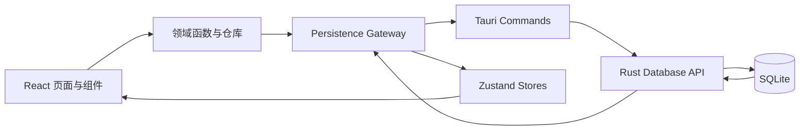

# Lens Cycle 系统架构

## 1. 架构目标

Lens Cycle 采用单机、离线优先架构。React 负责交互和展示，Rust/Tauri 提供受控的桌面
能力，SQLite 保存全部业务事实。系统优先保证数据一致性、可追溯性和失败可恢复，而不是
引入服务器或多端同步复杂度。

## 2. 技术栈

- Tauri 2 + Windows WebView2；
- React 19、TypeScript 5.9、Vite 8；
- Zustand、D3 模块、date-fns、Zod；
- Rust 1.98、rusqlite（bundled SQLite）；
- Vitest、Testing Library、Rust tests、WebView2 CDP；
- Node.js 24.19、pnpm 11.19。

精确版本以 `package.json`、`pnpm-lock.yaml`、`Cargo.lock`、`.node-version` 和
`rust-toolchain.toml` 为准。

## 3. 运行时数据流



页面不直接访问数据库。写操作先构造领域命令或候选 mutation，经 persistence gateway
调用 Tauri command；Rust 层再次规范化和校验，在 SQLite 事务提交成功后，前端才一次性
发布新的 Store 状态。失败时 Store 保持提交前状态。

## 4. 模块边界

```text
src/
  app/                  启动、主导航、全局持久化错误
  pages/                时间轴、库存、统计、设置
  features/catalog/     管理模板、标准类型、用品配置
  features/inventory/   产品、批次、流水、事务、备份适配
  features/timeline/    生命周期、事件、预测、视窗和轨道算法
  stores/               只发布已提交状态的 Zustand Store
  shared/               日期和通用组件
src-tauri/
  src/lib.rs            应用初始化、IPC、数据位置、备份与恢复
  src/database.rs       SQLite 映射、关系校验和事务
  migrations/           可执行 schema 迁移
  capabilities/         Tauri 权限
tests/                  169 项验收定义和桌面自动化驱动
scripts/                环境、QA、Release 和产物维护
```

推荐依赖方向为 `pages -> features/stores -> gateway -> Tauri commands -> database`。
`features/timeline/domain` 中的计算保持为不依赖 React、Tauri 和 SQLite 的纯函数。

## 5. 启动与关闭

1. Tauri 解析默认或用户选择的数据位置；
2. Rust 打开 SQLite，应用迁移并执行 schema/健康检查；
3. 前端通过 IPC 加载业务快照和偏好，再初始化 Store；
4. 失败时停留在启动错误页，不进入业务界面；
5. 关闭窗口前前端 flush 待保存偏好，再由 Rust 退出进程。

单实例插件避免同一用户重复启动多个独立应用实例。正式入口没有浏览器内存或
`localStorage` 业务回退。

## 6. 存储架构

- 数据库文件名为 `lens-cycle.sqlite3`，默认位置由 Tauri 应用数据目录决定；
- `LENS_CYCLE_DATA_DIR` 用于开发和测试时显式指定隔离目录；
- 可执行 schema 的唯一来源是 `src-tauri/migrations`；
- 默认启用外键、WAL、`synchronous=FULL`、busy timeout 和启动 `quick_check`；
- 备份为带版本和完整性校验的 JSON；
- 恢复和数据位置移动先建立 staging 数据库并完整回读，再切换当前数据源。

## 7. 桌面安全边界

- IPC 参数在 TypeScript 和 Rust 两侧校验；数据库约束是最终防线；
- CSP 默认仅允许本地资源，图片额外允许 `data:`；
- 备份文件选择与保存使用 Tauri dialog 插件；
- 数据目录必须是可规范化、可写且可验证的本机路径；
- 数据损坏、非法备份和迁移失败不得覆盖原数据库；
- 应用不需要网络服务、账户令牌或远程数据库凭据。

## 8. 构建架构

Vite 生成前端静态资源，Tauri 将其嵌入 Windows Release。正式脚本为每个 Run 创建
`artifacts/runs/<run-id>`，隔离 Vite 输出、Cargo target、覆盖率、日志和测试数据；最终
可分发文件复制到 `releases/<version>/windows-x64`。生成物由 `.gitignore` 排除。

领域和事务细节见 [system_design.md](./system_design.md)，开发命令见
[development.md](./development.md)。
